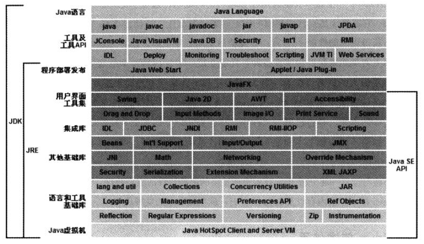

# Java虚拟机相关总结

## Java 技术体系

- Java 程序设计语言
- Java 虚拟机
- Java API 类库
- Class 文件格式
- 第三方 Java 类库

前三个称为 JDK (Java Development Kit).
另外把 Java API 类库中的 Java SE API 子集和 Java虚拟机部分成为 JRE (Java Runtime Environment).

## Java 内存区域和内存溢出异常

- 程序计数器
- Java 虚拟机栈
- 本地方法栈
- Java 堆
- 方法区
- 运行时常量池
- 直接内存
